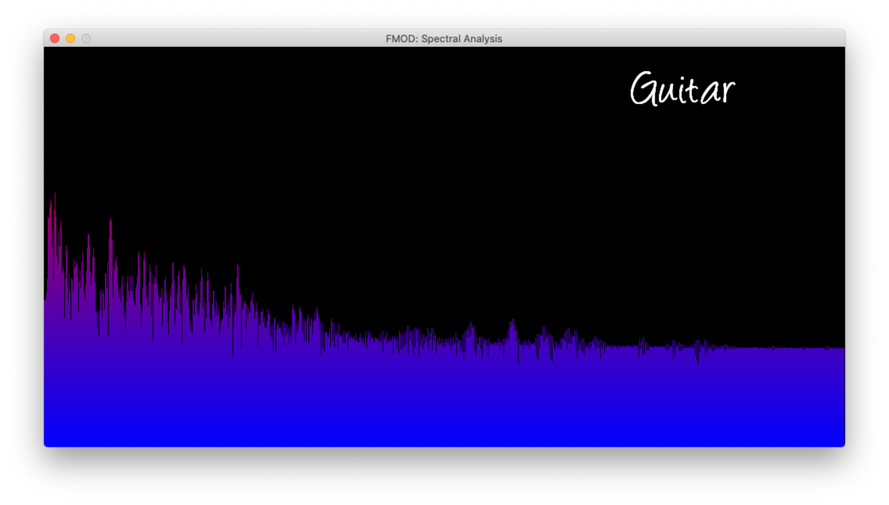

# Spectral

This repository contains a project representing the spectrum of the sound in real time, the left side of the window represents the low frequencies whereas the right end of the window represents the high frequencies. The height of each bars represents the current energy distribution of the sound. This project is coded based on the [Open Classroom](https://openclassrooms.com/fr/courses/19980-apprenez-a-programmer-en-c/19556-tp-visualisation-spectrale-du-son) exercise, and requires [SDL2](https://www.libsdl.org/index.php) as well as [FMOD](https://www.fmod.com).

The spectrum is displayed on a 512x1024 window with a refreshing rate of 5ms. An example, of the spectrum obtained for a range played with a guitar is pictured below.

